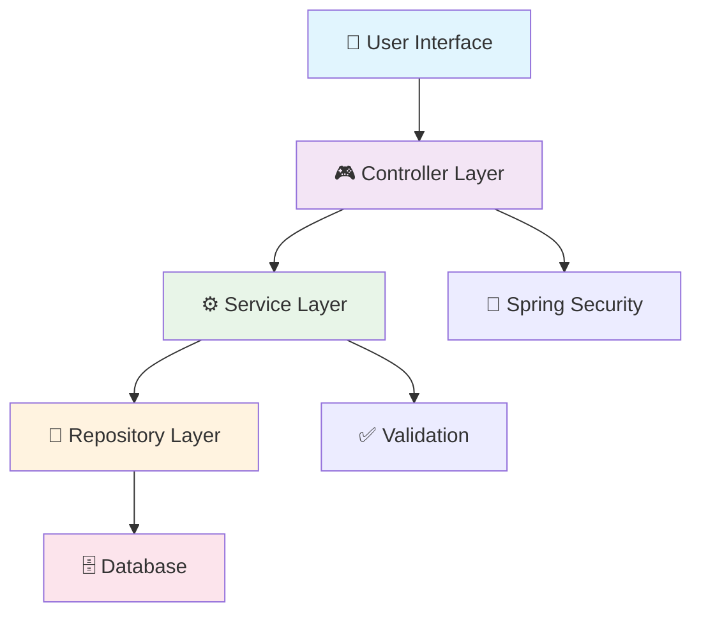

# 📚 BookHub Online Bookstore

<div align="center">


### 🛍️ A modern, full-stack online bookstore built with Spring Boot

<br>

[](https://www.oracle.com/java/)
[](https://spring.io/projects/spring-boot)
[](https://spring.io/projects/spring-security)
[](https://www.mysql.com/)
[](https://getbootstrap.com/)

<br>

**[🌟 Live Demo](https://bookhub-production.up.railway.app/)** • **[📚 API Docs](#-api-documentation)** • **[🚀 Quick Start](#-quick-start)** • **[💬 Contact](#-contact)**

<br>

---

</div>

## 🎯 About This Project

BookHub is a **comprehensive online bookstore application** that demonstrates modern Java web development practices. Built with **Spring Boot** and featuring a complete e-commerce workflow, this project showcases enterprise-level architecture, security implementation, and user experience design.

> 💡 **Perfect for demonstrating**: Full-stack development skills, Spring framework mastery, database design, and modern web practices

<br>

## ✨ Key Features

<table>
<tr>
<td width="50%">

### 🛍️ **Customer Experience**
- 🔐 **Secure Registration & Login**
- 📚 **Interactive Book Catalog**
- 🔍 **Smart Search & Filtering**
- 📱 **Responsive Design**
- 📖 **Detailed Book Information**

</td>
<td width="50%">

### 👨‍💼 **Admin Management**
- 👥 **User Management Dashboard**
- 📚 **Book Inventory Control**
- 🏷️ **Category Management**
- 📊 **System Analytics**
- 🔧 **Role-Based Access Control**

</td>
</tr>
</table>

<br>

## 🛠️ Technology Stack

<div align="center">

### **Backend**


### **Database**


### **Frontend**


</div>

<br>

## 🏗️ Architecture Overview



<br>

## 🚀 Quick Start

### 📋 Prerequisites

```bash
☕ Java 17 or higher
📦 Maven 3.6+
🗄️ MySQL 8.0+ (optional - H2 included)
🔧 Git
```

### ⚡ Installation

1. **Clone the repository**
   ```bash
   git clone https://github.com/your-username/BookHub.git
   cd BookHub
   ```

2. **Build the project**
   ```bash
   mvn clean install
   ```

3. **Run the application**
   ```bash
   mvn spring-boot:run
   ```

4. **Access the application**
   
   🌐 **Application**: http://localhost:8080
   
   🗄️ **Database Console**: http://localhost:8080/h2-console

<br>

## 🔑 Demo Accounts

| Role | Username | Password | Access Level |
|:---:|:---:|:---:|:---:|
| 👑 **Admin** | `admin` | `admin123` | Full system access |
| 👤 **User** | `johndoe` | `password123` | Customer features |
| 👤 **User** | `janesmith` | `password123` | Customer features |

<br>

## 📸 Application Screenshots

<details>
<summary>🖼️ <strong>Click to view screenshots</strong></summary>

<br>

### 🏠 Homepage
> *Modern landing page with featured books and intuitive navigation*

### 📚 Book Catalog  
> *Responsive grid layout with advanced search and filtering*

### 📖 Book Details
> *Comprehensive book information with purchase options*

### 🔐 User Authentication
> *Secure login/register with real-time validation*

### 👨‍💼 Admin Dashboard
> *Complete management interface for books and users*

</details>

<br>

## 📁 Project Structure

```
bookhub-online-bookstore/
├── 📂 src/main/java/com/bookhub/
│   ├── 📂 config/              # 🔧 Configuration classes
│   ├── 📂 controller/          # 🎮 REST & Web controllers  
│   ├── 📂 service/             # ⚙️ Business logic layer
│   ├── 📂 repository/          # 💾 Data access layer
│   ├── 📂 entity/              # 📋 JPA entities
│   └── 📄 BookstoreApplication.java
├── 📂 src/main/resources/
│   ├── 📂 templates/           # 🎨 Thymeleaf templates
│   ├── 📂 static/              # 🌐 CSS, JS, images
│   └── 📄 application.yml      # ⚙️ App configuration
├── 📂 src/test/               # 🧪 Tests
├── 📄 pom.xml                 # 📦 Maven dependencies
└── 📄 README.md
```

<br>

## 🗄️ Database Design

<details>
<summary>📊 <strong>Entity Relationship Diagram</strong></summary>

<br>

```
👤 User (1) ──────── (N) 📋 Order (1) ──────── (N) 📦 OrderItem (N) ──────── (1) 📚 Book
   │                                                                               │
   │                                                                               │
   │ (1)                                                                      (N)  │
   │                                                                               │
   🛒 Cart (1) ──────── (N) 🛍️ CartItem (N) ──────────────────────────────────────┘
                                                                                   │
                                                                              (N)  │
                                                                                   │
                                                           🏷️ Category (1) ────────┘
```

**Key Entities:**
- 👤 **User**: Authentication, profile management
- 📚 **Book**: Product catalog with details
- 🏷️ **Category**: Book organization  
- 🛒 **Cart**: Shopping cart functionality
- 📋 **Order**: Purchase transactions

</details>

<br>

## 🔗 API Documentation

<details>
<summary>🚀 <strong>Complete API Reference</strong></summary>

<br>

### 🔐 Authentication
```http
POST /api/auth/register         # User registration
POST /api/auth/login           # User authentication  
POST /api/auth/logout          # User logout
```

### 📚 Books Management
```http
GET    /api/books                    # 📖 Get all books (paginated)
GET    /api/books/{id}               # 📖 Get specific book
GET    /api/books/search?keyword={}  # 🔍 Search books
GET    /api/books/category/{id}      # 🏷️ Books by category
POST   /api/books                    # ➕ Create book (Admin)
PUT    /api/books/{id}               # ✏️ Update book (Admin)
DELETE /api/books/{id}               # ❌ Delete book (Admin)
```

### 🏷️ Categories
```http
GET    /api/categories               # 📂 Get all categories
GET    /api/categories/{id}          # 📂 Get specific category
POST   /api/categories               # ➕ Create category (Admin)
PUT    /api/categories/{id}          # ✏️ Update category (Admin)
DELETE /api/categories/{id}          # ❌ Delete category (Admin)
```

### 👥 Users
```http
GET    /api/users                    # 👥 Get all users (Admin)
GET    /api/users/profile            # 👤 Current user profile
PUT    /api/users/profile            # ✏️ Update profile
GET    /api/users/check-username     # ✅ Username availability
GET    /api/users/check-email        # ✅ Email availability
```

</details>

<br>

## 🎯 Technical Highlights

<table>
<tr>
<td width="50%">

### 🏗️ **Architecture & Design**
- ✅ **Layered Architecture** - Clean separation of concerns
- ✅ **Dependency Injection** - Spring IoC container
- ✅ **Repository Pattern** - Data access abstraction
- ✅ **MVC Pattern** - Organized web layer

</td>
<td width="50%">

### 🔐 **Security & Validation**
- ✅ **BCrypt Password Hashing** - Secure authentication
- ✅ **Role-based Access Control** - User permissions
- ✅ **CSRF Protection** - Security best practices  
- ✅ **Input Validation** - Server & client-side

</td>
</tr>
<tr>
<td width="50%">

### ⚡ **Performance & Quality**
- ✅ **Pagination** - Efficient data loading
- ✅ **Lazy Loading** - Optimized JPA relationships
- ✅ **Query Optimization** - Custom JPQL queries
- ✅ **Error Handling** - Comprehensive exception management

</td>
<td width="50%">

### 🛠️ **Development Practices**
- ✅ **Clean Code** - Readable, maintainable codebase
- ✅ **SOLID Principles** - Well-structured design
- ✅ **RESTful API** - Standard web service design
- ✅ **Responsive Design** - Mobile-friendly interface

</td>
</tr>
</table>

<br>

## 🚀 Future Roadmap

<details>
<summary>📋 <strong>Planned Enhancements</strong></summary>

<br>

### 🛒 **E-commerce Features**
- [ ] **Shopping Cart** - Persistent cart functionality
- [ ] **Order Management** - Complete purchase workflow  
- [ ] **Payment Integration** - Stripe/PayPal integration
- [ ] **Email Notifications** - Order confirmations

### 🎯 **Advanced Features**  
- [ ] **JWT Authentication** - Stateless token-based auth
- [ ] **Redis Caching** - Performance optimization
- [ ] **Search Enhancement** - Elasticsearch integration
- [ ] **Real-time Updates** - WebSocket notifications

### ☁️ **DevOps & Deployment**
- [ ] **Docker Containerization** - Deployment ready
- [ ] **CI/CD Pipeline** - Automated testing & deployment
- [ ] **Cloud Deployment** - AWS/Azure hosting
- [ ] **Monitoring** - Application performance tracking

</details>

<br>

## 🧪 Testing

```bash
# Run all tests
mvn test

# Run with coverage report
mvn test jacoco:report

# Run specific test class
mvn test -Dtest=BookServiceTest
```

**Test Coverage:**
- ✅ Unit Tests - Service layer logic
- ✅ Integration Tests - Repository with database  
- ✅ API Tests - Controller endpoints
- 🔄 E2E Tests *(planned)*

<br>

## 🤝 Contributing

Contributions are welcome! Please feel free to submit a Pull Request.

### Development Workflow
1. **Fork** the repository
2. **Create** your feature branch (`git checkout -b feature/AmazingFeature`)
3. **Commit** your changes (`git commit -m 'Add some AmazingFeature'`)
4. **Push** to the branch (`git push origin feature/AmazingFeature`)
5. **Open** a Pull Request

<br>

## 📞 Contact

<div align="center">

### 👨‍💻 **Developer Information**

**Name**: Pai Liu  
**Email**: [pliu2024@outlook.com](mailto:pliu2024@outlook.com)  
**LinkedIn**: [www.linkedin.com/in/pailiu2025](www.linkedin.com/in/pailiu2025)  

---

### 🌟 **Open to Opportunities**
Currently seeking **Java Backend Developer** positions.  
Let's discuss how this project demonstrates my technical capabilities!

</div>

<br>

## 📄 License

This project is licensed under the **MIT License** - see the [LICENSE](LICENSE) file for details.

<br>

## 🙏 Acknowledgments

- 🍃 **Spring Boot Team** - For the excellent framework
- 🎨 **Bootstrap Team** - For responsive design components
- 💫 **Font Awesome** - For beautiful icons
- 🤝 **Open Source Community** - For continuous learning

<br>

---

<div align="center">

### ⭐ **Star this repository if you found it helpful!**

<br>

<br>

**[⬆ Back to Top](#-bookhub-online-bookstore)**

</div>
